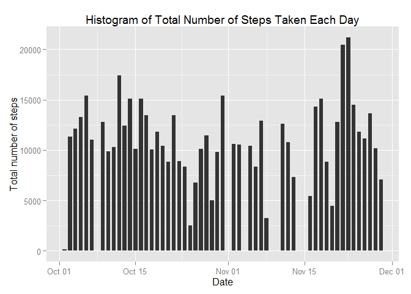
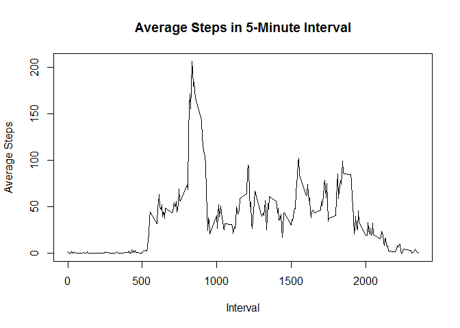
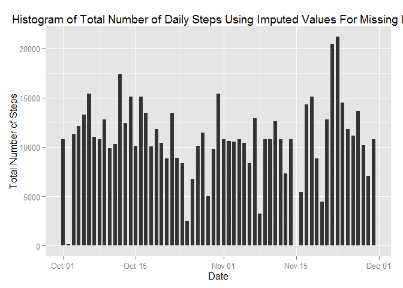
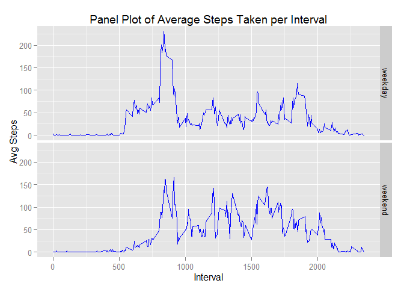

# Reproducible Research: Peer Assessment 1


## Loading and preprocessing the data  


```r
library(dplyr)
```

```
## Warning: package 'dplyr' was built under R version 3.1.3
```

```
## 
## Attaching package: 'dplyr'
## 
## The following object is masked from 'package:stats':
## 
##     filter
## 
## The following objects are masked from 'package:base':
## 
##     intersect, setdiff, setequal, union
```

```r
ActivityData <- tbl_df(read.csv("activity.csv", colClasses = c("integer", "Date", "integer")))
head(ActivityData)
```

```
## Source: local data frame [6 x 3]
## 
##   steps       date interval
## 1    NA 2012-10-01        0
## 2    NA 2012-10-01        5
## 3    NA 2012-10-01       10
## 4    NA 2012-10-01       15
## 5    NA 2012-10-01       20
## 6    NA 2012-10-01       25
```
  
### Remove NA observations   


```r
CleanActivityData <- na.omit(ActivityData)
head(CleanActivityData)
```

```
## Source: local data frame [6 x 3]
## 
##   steps       date interval
## 1     0 2012-10-02        0
## 2     0 2012-10-02        5
## 3     0 2012-10-02       10
## 4     0 2012-10-02       15
## 5     0 2012-10-02       20
## 6     0 2012-10-02       25
```


## What is the mean total number of steps taken per day?

### Histogram of the total number of steps taken each day

Calculate total number of steps per day  

```r
dailysteps <- CleanActivityData %>%
    select(date, steps) %>%
    group_by(date) %>%
    summarise_each(funs(sum))
```

Plot the total number of steps per day  

```r
library(ggplot2)
```

```
## Warning: package 'ggplot2' was built under R version 3.1.3
```

```r
ggplot(CleanActivityData, aes(date, steps)) + 
    geom_bar(stat = "identity", width = 0.7) + 
    labs(title = "Histogram of Total Number of Steps Taken Each Day", 
         x = "Date", 
         y = "Total number of steps")
```

 

Mean total number of steps taken per day  

```r
Mean1 <- mean(dailysteps$steps, na.rm=TRUE)
Mean1
```

```
## [1] 10766.19
```
Median total number of steps taken per day  

```r
Median1 <- median(dailysteps$steps, na.rm=TRUE)
Median1
```

```
## [1] 10765
```


## What is the average daily activity pattern?

### Time Series plot of the 5-minute interval and the average number of steps taken
Calculate 5-minute interval average  

```r
IntervalAvg <- CleanActivityData %>%
    select(interval, steps) %>%
    group_by(interval) %>%
    summarise_each(funs(mean))
```

Plot the data  

```r
plot(IntervalAvg$interval, IntervalAvg$steps,
     main = "Average Steps in 5-Minute Interval",
     xlab = "Interval",
     ylab = "Average Steps",
     type="l")
```

 

### The 5-minute interval containing the maximum number of steps on average

```r
MaxDailyAvg <- max(IntervalAvg$steps)
IntervalAvg[IntervalAvg$steps==MaxDailyAvg,]
```

```
## Source: local data frame [1 x 2]
## 
##   interval    steps
## 1      835 206.1698
```


## Imputing missing values  

### Total number of missing values  

```r
sum(is.na(ActivityData$steps))
```

```
## [1] 2304
```

### Imputing missing step values with the 5-minute interval average  

```r
ActivityData.imp <- ActivityData
for (i in 1:nrow(ActivityData.imp)) {
    if(is.na(ActivityData$steps[i])) {
        ActivityData.imp$steps[i] <- IntervalAvg[ActivityData.imp$interval[i] == IntervalAvg$interval, ]$steps
    }
}
```

### New Dataset  

```r
head(ActivityData.imp)
```

```
## Source: local data frame [6 x 3]
## 
##       steps       date interval
## 1 1.7169811 2012-10-01        0
## 2 0.3396226 2012-10-01        5
## 3 0.1320755 2012-10-01       10
## 4 0.1509434 2012-10-01       15
## 5 0.0754717 2012-10-01       20
## 6 2.0943396 2012-10-01       25
```

### Histogram of total number of steps taken each day using new dataset  

```r
ggplot(ActivityData.imp, aes(date, steps)) +
    geom_bar(stat = "identity",
            width = 0.7) +
    labs(title = "Histogram of Total Number of Daily Steps Using Imputed Values For Missing Data",
         x = "Date",
         y= "Total Number of Steps")
```

 

### Calculate total number of steps per day using new dataset  

```r
dailysteps.imp <- ActivityData.imp %>%
    select(date, steps) %>%
    group_by(date) %>%
    summarise_each(funs(sum))
```

### Mean total number of steps using new dataset  

```r
Mean2 <- mean(dailysteps.imp$steps, na.rm=TRUE)
Mean2
```

```
## [1] 10766.19
```

### Median total number of steps using new dataset

```r
Median2 <- median(dailysteps.imp$steps, na.rm=TRUE)
Median2
```

```
## [1] 10766.19
```

### Comparison of Means after imputing missing values  

```r
MeanDiff <- Mean2 - Mean1
MeanDiff
```

```
## [1] 0
```
The calculation of mean did not experience any change  
because I used the mean of the 5-minute interval to impute  
the missing step values.

### Comparison of Medians after imputing missing values  

```r
MedianDiff <- Median2 - Median1
MedianDiff
```

```
## [1] 1.188679
```
The calculation of median has drawn closer to the calculation  
of the mean value because I used the mean of the 5-minute  
interval to impute the missing step values.  


## Are there differences in activity patterns between weekdays and weekends?

### Creation of new factor variable "weekday"  

```r
library(lubridate)
```

```
## Warning: package 'lubridate' was built under R version 3.1.3
```

```r
ActivityData.imp$weekday <- wday(ActivityData.imp$date, label=TRUE)
levels(ActivityData.imp$weekday) <- list(weekday = c("Mon","Tues","Wed","Thurs","Fri"),
                                         weekend = c("Sat","Sun"))

levels(ActivityData.imp$weekday)
```

```
## [1] "weekday" "weekend"
```

```r
head(ActivityData.imp)
```

```
## Source: local data frame [6 x 4]
## 
##       steps       date interval weekday
## 1 1.7169811 2012-10-01        0 weekday
## 2 0.3396226 2012-10-01        5 weekday
## 3 0.1320755 2012-10-01       10 weekday
## 4 0.1509434 2012-10-01       15 weekday
## 5 0.0754717 2012-10-01       20 weekday
## 6 2.0943396 2012-10-01       25 weekday
```

### Panel plot of 5-minute interval and average number of steps taken  
Calculate 5-minute interval average  

```r
IntervalAvg.imp <- ActivityData.imp %>%
    select(weekday,interval, steps) %>%
    group_by(weekday, interval) %>%
    summarise_each(funs(mean))
head(IntervalAvg.imp)
```

```
## Source: local data frame [6 x 3]
## Groups: weekday
## 
##   weekday interval      steps
## 1 weekday        0 2.25115304
## 2 weekday        5 0.44528302
## 3 weekday       10 0.17316562
## 4 weekday       15 0.19790356
## 5 weekday       20 0.09895178
## 6 weekday       25 1.59035639
```

Plot the data  

```r
ggplot(IntervalAvg.imp, aes(interval, steps)) +
    geom_line(stat = "identity", colour="blue") + 
    facet_grid(weekday~.) + 
    labs(title="Panel Plot of Average Steps Taken per Interval",
         x = "Interval",
         y= "Avg Steps")
```

 
